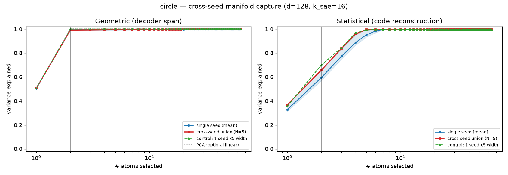

# cross-seed-manifold-poc

A small experiment. Train several TopK sparse autoencoders that differ only in
their random seed, pool their features, and check whether the pool reconstructs a
known concept manifold using fewer features than a single SAE does.

The data is synthetic, so the manifold geometry is known and reconstructions can
be scored against ground truth. The setup follows the synthetic benchmark in
Bhalla et al., "Do Sparse Autoencoders Capture Concept Manifolds?" (2026),
https://arxiv.org/abs/2604.28119.

## Running it

Easiest is the marimo notebook. Dependencies are declared inline, so with `uv`
there is nothing to install first:

```
uvx marimo edit --sandbox notebook.py
```

It lets you pick a manifold shape, look at its geometry, train the seed sweep, and
compare reconstructions (single seed vs. pooled union vs. a same-width single SAE
vs. PCA).

To run the experiments as scripts:

```
uv sync
uv run run_poc.py --quick     # ~30s smoke test; writes figures to results/figures/
uv run sweep.py               # capacity x sparsity sweep
uv run mechanism.py           # seed diversity vs. just having N independent SAEs
uv run matched_control.py     # control matching the pool's active-feature count
```

Everything runs on CPU. Saved outputs from earlier runs are in `results/`.

## Results so far

Preliminary, and on the toy data only.

In a moderate-capacity regime (roughly one to a few SAE features per manifold
dimension), the pooled union reconstructs the target manifold with fewer features
than a single seed, and does somewhat better than a single SAE given the same
total width and the same training compute. On circle and swiss-roll manifolds the
gap is around +0.2 to +0.3 in the few-feature reconstruction score.

The effect depends on the regime. It shrinks when the SAE is large relative to the
manifold, and it reverses when features are scarce. Most of the gain comes from
having several independent SAEs to pool from; a smaller and fairly consistent part
comes from the seed difference itself. This is one metric on synthetic data and
has not been tested on real models.



## Implementation

- `synthetic.py` — the benchmark. Eight manifold shapes (circle, helix, sphere,
  torus, mobius, swiss roll, disk, line), each placed in a random subspace of a
  128-dim space via a random orthonormal map. A sample is a sparse sum of a few
  manifolds plus small Gaussian noise.
- `sae.py`, `train.py` — a minimal TopK SAE and trainer. Per-sample top-k,
  unit-norm decoder, dead-feature resampling. The weight-init seed and the
  data-order seed are separate, which is what lets us tell seed diversity apart
  from data-order noise.
- `metrics.py` — the reconstruction score: a greedy "restricted R^2" measuring how
  few features are needed to reconstruct a manifold's activations.
- `run_poc.py`, `sweep.py`, `mechanism.py`, `matched_control.py` — the experiments.

`sae.py` and `metrics.py` adapt code from goodfire-ai/sae-manifold (MIT).

## License

MIT.
