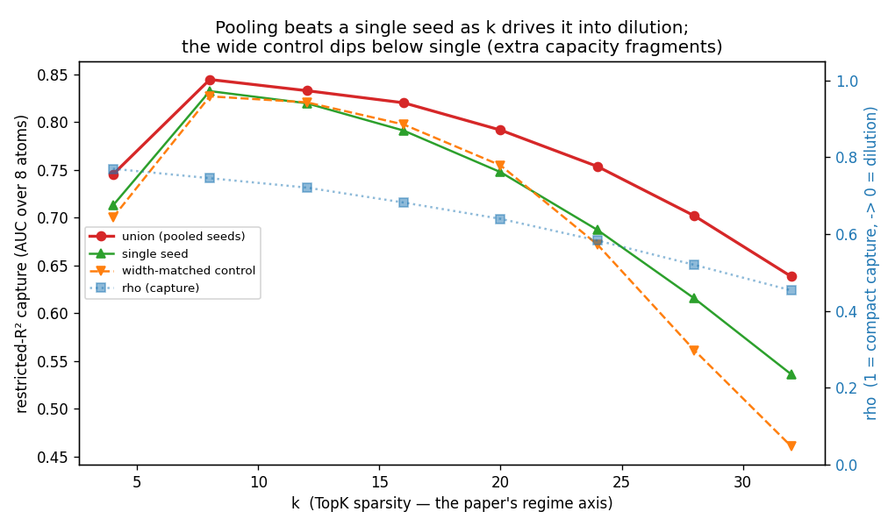

# cross-seed-manifold-poc

A small experiment. Train several TopK sparse autoencoders that differ only in
their random seed, pool their features, and check whether the pool reconstructs a
known concept manifold using fewer features than a single SAE does.

The data is synthetic, so the manifold geometry is known and reconstructions can
be scored against ground truth. The setup follows the synthetic benchmark in
Bhalla et al., "Do Sparse Autoencoders Capture Concept Manifolds?" (2026),
https://arxiv.org/abs/2604.28119.

## Running it

Easiest is the marimo notebook. Dependencies are declared inline, so with `uv`
there is nothing to install first:

```
uvx marimo edit --sandbox notebook.py
```

It lets you pick a manifold shape, look at its geometry, train the seed sweep, and
compare reconstructions (single seed vs. pooled union vs. a same-width single SAE
vs. PCA).

To run the experiments as scripts:

```
uv sync
uv run ksweep.py              # the headline: cross-seed benefit vs. sparsity k
uv run run_poc.py --quick     # ~30s smoke test; single-config reconstruction demo
uv run sweep.py               # capacity x sparsity sweep
uv run mechanism.py           # seed diversity vs. just having N independent SAEs
uv run matched_control.py     # control matching the pool's active-feature count
```

Everything runs on CPU. Saved outputs from earlier runs are in `results/`.

## Results so far

Preliminary, toy data only, one reconstruction metric.

Following the paper, a manifold's fate is governed by the TopK sparsity `k`: near
`k ≈ manifold dimension` a single SAE captures it compactly, and as `k` grows the
capture dilutes across many redundant atoms. Pooling several seeds helps *unevenly*
along this axis (`ksweep.py`):

- Where a single SAE captures compactly (small `k`), pooling adds little — the
  manifold is already reconstructed from a handful of atoms.
- As `k` pushes the SAE into dilution, the pooled union pulls ahead of a **single
  seed**: the gap grows from near zero (compact capture) to roughly **+0.1** in the
  few-feature reconstruction score (deep dilution). We measure against one seed — a
  consistent baseline — rather than against the width-matched control, which is itself
  unreliable (see below), so `ksweep.py` plots single / union / control as raw scores.

So the benefit tracks dilution: pooling seeds helps most where a single SAE stops
capturing the manifold cleanly. (An earlier version of this repo swept SAE *capacity*
at a fixed high `k` with a much more crowded dictionary, which pinned everything in
dilution and hid this structure; the sparsity axis and a paper-matched dictionary are
what make it legible.)

Two notes on mechanism. First, the width-matched control is not a free win for "just
make one SAE wider": at high `k` a single wide SAE reconstructs the manifold *worse*
than one narrow seed — extra capacity at high sparsity fragments the manifold instead
of spanning it. That capacity-pathology is the paper's dilution thesis visible in one
number, and it's why union-minus-control overstates the benefit (it mixes "union wins"
with "control fails"). Second, decomposing the union's gain, roughly half comes from
simply having several independent SAEs to pool and half from the seed difference
itself — averaging aligned seeds does not reproduce it, so the seeds cover complementary
regions rather than denoising a shared solution.

A second lens tells the same story. Instead of "how many atoms to reconstruct a
manifold," ask "how many manifolds does one atom respond to" (a per-atom polysemanticity
score; the notebook's splintering section). Where a single SAE captures compactly the
atoms are near-monosemantic; in dilution they smear across several manifolds. Across
seeds, the *amount* of this smearing is nearly constant, but *which* manifolds a given
seed smears varies — so pooling seeds tends to cover manifolds that any one seed
fractures. This is a re-description of the same dilution-regime benefit, not independent
evidence, and it does **not** establish that pooling beats a single equally-wide SAE —
that comparison rests on the width-matched control, which is unreliable (above).

None of this has been tested on a real model, where the manifold geometry is unknown.



## Implementation

- `synthetic.py` — the benchmark. Eight manifold shapes (circle, helix, sphere,
  torus, mobius, swiss roll, disk, line), each placed in a random subspace of a
  128-dim space via a random orthonormal map. A sample is a sparse sum of a few
  manifolds plus small Gaussian noise.
- `sae.py`, `train.py` — a minimal TopK SAE and trainer. Per-sample top-k,
  unit-norm decoder, dead-feature resampling. The weight-init seed and the
  data-order seed are separate, which is what lets us tell seed diversity apart
  from data-order noise.
- `metrics.py` — the reconstruction score: a greedy "restricted R^2" measuring how
  few features are needed to reconstruct a manifold's activations.
- `ksweep.py`, `run_poc.py`, `sweep.py`, `mechanism.py`, `matched_control.py` — the
  experiments. `ksweep.py` is the main one (cross-seed benefit across the sparsity axis).

`sae.py` and `metrics.py` adapt code from goodfire-ai/sae-manifold (MIT).

## License

MIT.
